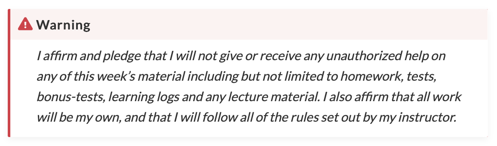

# Learning Logs

This week's learning log assignment will be posted on Canvas by Thursday.

Here are the questions you will be asked to answer in the learning logs.

## Task 1: TBD

Details coming soon.

## Task 2: Renew your vows

Each week, I am asking you to type out the integrity pledge, letter by letter, so you understand how important it is to me that you maintain your academic integrity as you go through this course.

## Task 3: Well-being check

One of my goals this year is to help you (as best I can) manage your stress and anxieties by "measuring it" on a weekly basis and intervening or making suggestions during our weekly class meeting.
This is an exciting time for all of you as many of you are starting your undergraduate studies.
With this new excitement, you may be feeling additional stress and anxiety as you learn to manage this new life with its drastic changes, that too in the middle of a pandemic.
In terms of providing support for you as an instructor I’d like for us to measure/rate your anxiety and stress levels - I understand that you may not know what level of stress and/or anxiety is appropriate at this level of your education so feel free to note that! 

Q1: On a scale of 1-10, rate your CURRENT level of anxiety and stress: 

Anxiety: 1-10
Stress: 1-10

Q2: On a scale of 1-10, rate WHERE DO YOU THINK YOUR level of anxiety and stress SHOULD BE: 

Anxiety: 1-10
Stress: 1-10

Q3: Is there anything else you would like to tell me?

[Open Text]

I’ll do what I can within my role as an instructor, in terms of workload and deadlines.
Part of undergraduate life and healthy living is finding ways to manage your stress and anxiety in a manner that is effective for you - this will look different for each person! 
If you want to explore additional resources, start with the ones listed at [UBCO Health & Wellness](https://students.ok.ubc.ca/health-wellness/) and see if the tips there work for you!

Finally, remember (from the course syllabus): as I'm sure you're aware, *there is a global pandemic* happening right now and we could all use some extra compassion and humanity.
If you're going through something that is affecting you (course or otherwise), you are always welcome to come and talk to me about it. 
If I am not able to help you myself, then I can probably direct you to the right person or resource.