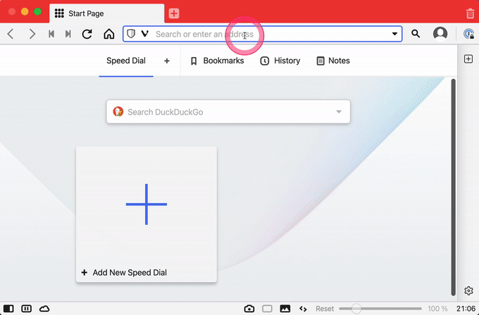
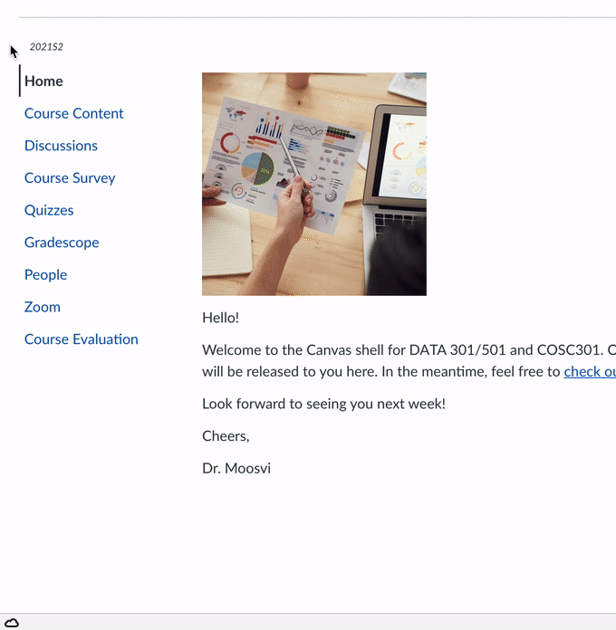
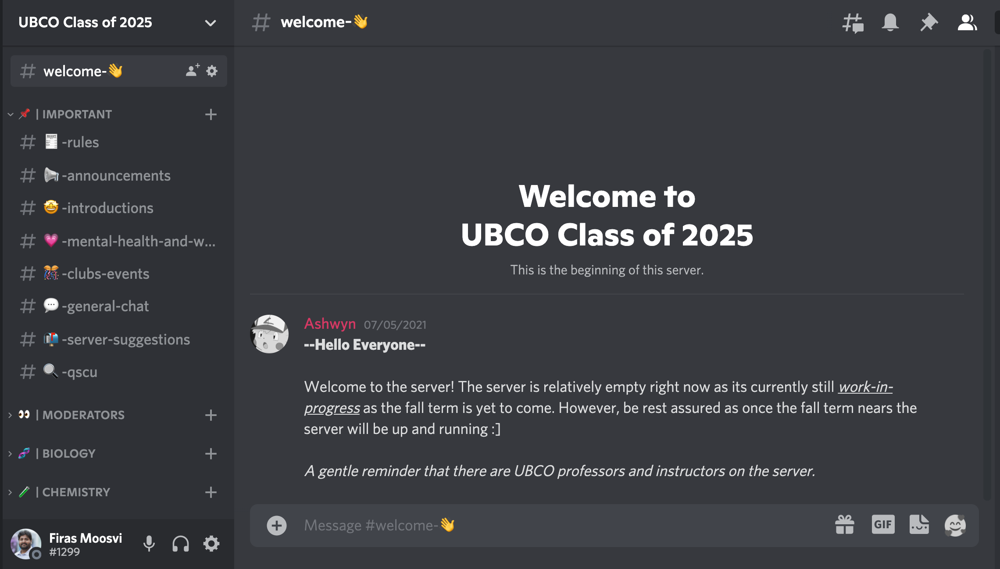

Things to do at the start of the course
=======================

There are several things you'll need to do at the start of the course to get set up with all the technology, accounts, and services we'll be using.
I've split these tasks up into several chunks so it's a bit more manageable. 

## Before Term Starts

```{dropdown} 1. Log into Canvas
    :class-container: sd-shadow-lg
    :color: primary
    :open:

Canvas is the go-to platform at UBC Okanagan.
You can access it by going to: https://canvas.ubc.ca and logging in with your CWL.
I expect you'll find most of your courses to be using the Canvas platform.
All the information and content for this course will be posted on Canvas.

In my course, the left sidebar is where you will find most things.
It's fairly intuitive, but the Centre for Teaching, Learning, and Technology has created a [Canvas Student Guide](https://lthub.ubc.ca/guides/canvas-student-guide/).


```

```{dropdown} 2. Claim your @student.ubc.ca email
    :class-container: sd-shadow-lg
    :color: primary
    :open:

**All active and registered students are eligible to sign up for a <CWL>@student.ubc.ca email account** that can be used to send and receive mail.
This account will also grant you access to a range of UBC services that might be useful for you, including Microsoft OneDrive, and Office 365.
OneDrive will be useful for you to store or share your documents, and backup your work.
Office365 includes the standard apps such as Microsoft Word, Excel, Powerpoint.

There are only two steps to get a UBC email:

1. Sign up for a Student Email Address
2. Sign in to the [CWL myAcccount page](https://www.myaccount.ubc.ca/myAccount/login.xhtml) and click on "Activate Student Email"
    - You must be registered in a course and in good standing to be eligible for this service
    - Access your email here: [UBC Student Webmail](https://webmail.student.ubc.ca/)

I strongly urge you to take this opportunity (before your life gets busier and crazier) to sign-up for an email through UBC and start using that for any professional or official communications.
These services are very expensive if you were to pay for them yourself; you can get an @student.ubc.ca email at no cost to you.

A professional email like this will be much better for you than a hotmail or even, a gmail account. 
Trust me when I say this, I am speaking from experience! 
I thought I was very clever when I created my first email address (shaq_daddy00@hotmail.com). For a long time, that was the email I used for everything. 
It was only when I arrived at University that I realized how bad that email was.
I will pass on this same advice to you: get a professional email address, use it, and check it frequently!

P.S. Your CWL is your campus wide login - this is something you would have created when you first applied to UBC and you will use this for the rest of your academic career (at UBC). 
```

```{dropdown} 3. On the left sidebar in Canvas, click on Gradescope.
    :class-container: sd-shadow-lg
    :color: primary

You should then be guided through a series of steps to create an account, set a password, and link it to our course. 

This is **very** important for you to do as it'll be our primary mechanism for delivering you feedback in this course.


```

```{dropdown} 4. Join Ed Discussion and say hi!
    :class-container: sd-shadow-lg
    :color: primary


```

```{dropdown} 5. [Optional] Sign up for the unofficial UBCO 1st Year Science Discord Server
    :class-container: sd-shadow-lg
    :color: primary

Some of your first year instructors have banded together to create a Discord server where students can chat with each other, share stories and experiences (or funny TikTok videos), and interact with each other. 
This is essentially a glorified (and more organized) instant messaging service - some of you may already be on other Discords (if you are, I might ask you to help moderate).
In this online environment, we believe this is our best change of maintaining some level of human interaction.

You are not certainly not required to sign up for this service as the data is not hosted on Canadian servers, but if you like, you can sign up for the Discord server with this invitation link: https://discord.gg/9XtKGyfjvm.


```

```{dropdown} 6. [Required] Take a break!
    :class-container: sd-shadow-lg
    :color: primary

There's still a few days of summer left, go outside, enjoy the sunshine!
Rest, recover, heal from everything you've been through over the last year.


[Photo by A Little & Tiny Man from Pexels](https://www.pexels.com/photo/woman-in-black-hijab-headscarf-walking-on-field-789555/)
```