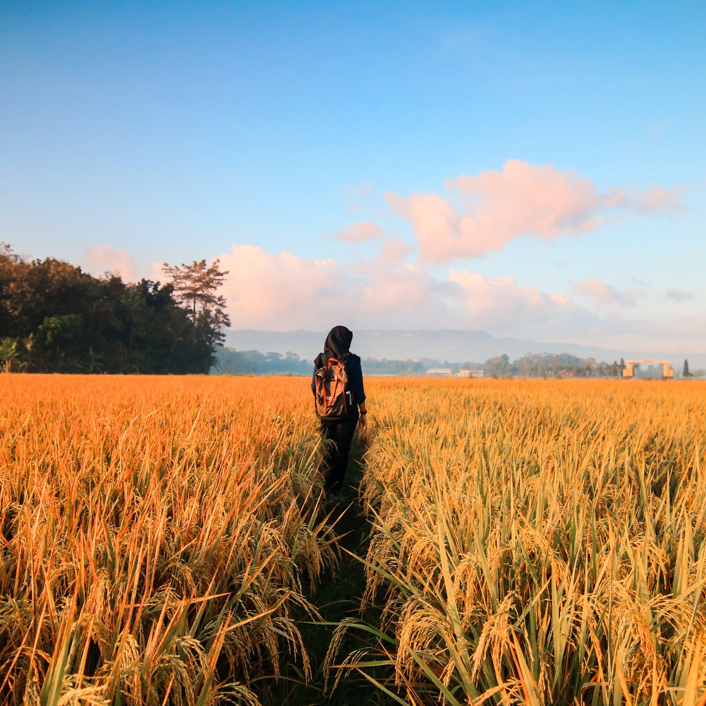

Things to do at the start of the course
=======================

There are several things you'll need to do at the start of the course to get set up with all the technology, accounts, and services we'll be using.
I've split these tasks up into several chunks so it's a bit more manageable. 

## Before Term Starts

```{dropdown} 1. Log into Canvas
    :container: + shadow
    :title: bg-success text-white font-weight-bold
    :open:

Canvas is the go-to platform at UBC Okanagan.
You can access it by going to: https://canvas.ubc.ca and logging in with your CWL.
I expect you'll find most of your courses to be using the Canvas platform.
All the information and content for this course will be posted on Canvas.

In my course, the left sidebar is where you will find most things.
It's fairly intuitive, but the Centre for Teaching, Learning, and Technology has created a [Canvas Student Guide](https://lthub.ubc.ca/guides/canvas-student-guide/).


```

```{dropdown} 2. On the left sidebar in Canvas, click on Gradescope.
    :container: + shadow
    :title: bg-success text-white font-weight-bold

You should then be guided through a series of steps to create an account, set a password, and link it to our course. 

This is **very** important for you to do as it'll be our primary mechanism for delivering you feedback in this course.


```

```{dropdown} 3. Join Ed Discussion and say hi!
    :container: + shadow
    :title: bg-success text-white font-weight-bold


```

```{dropdown} 4. [Optional] Sign up for the unofficial UBCO 1st Year Science Discord Server
    :container: + shadow
    :title: bg-info text-white font-weight-bold

Some of your first year instructors have banded together to create a Discord server where students can chat with each other, share stories and experiences (or funny TikTok videos), and interact with each other. 
This is essentially a glorified (and more organized) instant messaging service - some of you may already be on other Discords (if you are, I might ask you to help moderate).
In this online environment, we believe this is our best change of maintaining some level of human interaction.

You are not certainly not required to sign up for this service as the data is not hosted on Canadian servers, but if you like, you can sign up for the Discord server with this invitation link: https://discord.gg/9XtKGyfjvm.


```

```{dropdown} 5. [Required] Take a break!
    :container: + shadow
    :title: bg-success text-white font-weight-bold

There's still a few days of summer left, go outside, enjoy the sunshine!
Rest, recover, heal from everything you've been through over the last year.



[Photo by A Little & Tiny Man from Pexels](https://www.pexels.com/photo/woman-in-black-hijab-headscarf-walking-on-field-789555/)
```